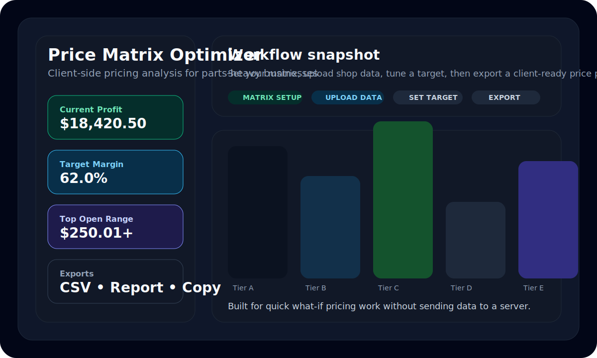

# 📊 Price Matrix Optimizer

An intelligent pricing optimization tool for parts-based businesses. Upload your sales data, define profit targets, and receive data-driven pricing recommendations — all running locally in your browser.



---

## ✨ Features

- **CSV Upload** — Import sales data from any POS system (Tekmetric, Shop-Ware, Mitchell, etc.)
- **Customizable Price Matrix** — Define cost-range tiers with multipliers and gross profit targets
- **Smart Tier Optimization** — Weighted algorithm balances sales volume and margin headroom
- **Interactive Results** — Edit any recommended multiplier and watch other tiers auto-adjust
- **Visual Charts** — Bar charts for parts distribution and multiplier comparisons (Recharts)
- **Export Options** — Download optimized matrix as CSV, formatted report, or copy to clipboard
- **Persistent Settings** — Matrix configuration auto-saves to browser localStorage
- **Fully Client-Side** — No server, no data leaves your machine

## 🛠 Tech Stack

| Layer       | Technology                          |
| ----------- | ----------------------------------- |
| Framework   | React 19                            |
| Build Tool  | Vite 7                              |
| Charts      | Recharts 3                          |
| Styling     | Tailwind CSS 3                      |
| Linting     | ESLint 9 with React Hooks plugin    |
| Container   | Docker (Node 20 Alpine + Nginx)     |

## 🚀 Getting Started

### Prerequisites

- **Node.js** ≥ 18
- **npm** ≥ 9

### Install & Run

```bash
# Clone the repository
git clone https://github.com/get2salam/price-matrix-demo.git
cd price-matrix-demo

# Install dependencies
npm install

# Start development server
npm run dev
```

The app will be available at **http://localhost:5173**.

### Build for Production

```bash
npm run build
npm run preview   # preview the production build locally
```

### Docker

```bash
# Build and run with Docker Compose
docker compose up --build

# Or manually
docker build -t price-matrix-optimizer .
docker run -p 8080:80 price-matrix-optimizer
```

The containerized app serves on **http://localhost:8080**.

## 📖 How It Works

1. **Define your price matrix** — Set cost-range tiers (e.g. $0–$1.50, $1.51–$6.00, …) with target multipliers and gross profit percentages.

2. **Upload sales data** — Import a CSV export from your shop management system. The parser auto-detects header rows and handles currency-formatted values (`$1,234.56`).

3. **Set a profit target** — Choose between percentage growth, target margin, or a fixed dollar increase.

4. **Receive recommendations** — The optimizer distributes price adjustments across tiers using a weighted algorithm:
   - **60% volume weight** — Tiers with higher revenue share receive proportionally larger adjustments (bigger impact).
   - **40% headroom weight** — Tiers with lower current margins get more room to increase without hitting price sensitivity.
   - **Safety caps** — No tier increases more than 50%, and gross profit is capped at 95%.
   - **Convergence loop** — An iterative solver nudges multipliers until projected profit matches the target (within 0.5% tolerance).

5. **Fine-tune & export** — Manually override any tier's multiplier; the optimizer redistributes the remaining tiers to still hit your target. Export the final matrix as CSV, a printable report, or copy directly to your clipboard.

## 📁 Project Structure

```
├── src/
│   ├── App.jsx          # Main application component
│   ├── App.css          # Component styles
│   ├── index.css        # Tailwind directives
│   └── main.jsx         # React entry point
├── public/              # Static assets
├── Dockerfile           # Multi-stage Docker build
├── docker-compose.yml   # Container orchestration
├── tailwind.config.js   # Tailwind CSS configuration
├── postcss.config.js    # PostCSS configuration
├── vite.config.js       # Vite build configuration
├── eslint.config.js     # ESLint flat config
├── Makefile             # Common development commands
└── package.json
```

## 🤝 Contributing

1. Fork the repository
2. Create a feature branch (`git checkout -b feature/my-feature`)
3. Commit your changes (`git commit -m 'feat: add my feature'`)
4. Push to the branch (`git push origin feature/my-feature`)
5. Open a Pull Request

## 📄 License

This project is licensed under the [MIT License](LICENSE).
